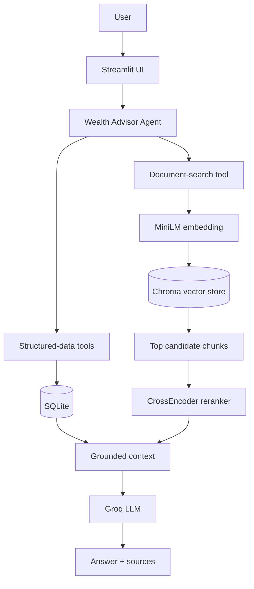

# Wealth Advisor Assistant

An agentic retrieval-augmented generation (RAG) prototype built for the HCL Hackathon. It helps wealth advisers investigate client, portfolio, product, policy, complaint, and correspondence questions by combining structured records with evidence retrieved from internal documents.

The assistant is designed for decision support—not autonomous financial advice. It grounds material claims in retrieved evidence, exposes sources, and abstains when the available data is insufficient.

## Key capabilities

- Natural-language questions through a Streamlit interface
- Agent-directed use of structured and unstructured data tools
- Exact lookup of client, portfolio, and transaction records in SQLite
- Semantic search across policies, factsheets, RM notes, complaints, and correspondence in Chroma
- MiniLM embeddings with CrossEncoder reranking
- Evidence-backed answers with source metadata
- Optional query rewriting, query fusion, and document-type routing for experimentation
- Retrieval evaluation using labelled evidence and Recall@K
- Conservative grounding: unsupported facts and investment actions are not invented

## Architecture



Fallback view:

```text
User -> Streamlit -> Advisor Agent
                       |-- SQLite tools: clients, portfolios, transactions
                       `-- Chroma search -> CrossEncoder reranking
                                      |
                         grounded evidence -> Groq LLM -> answer + sources
```

## How it works

1. The agent interprets the question and selects the necessary tools.
2. Structured tools retrieve exact client or portfolio facts from SQLite.
3. Document search embeds the question and retrieves candidate chunks from Chroma.
4. The default CrossEncoder reads each question–chunk pair and reranks the candidates.
5. The Groq-hosted LLM synthesizes the returned evidence into a bounded answer with sources.
6. If the tools do not return enough evidence, the assistant should state what is missing instead of guessing.

## Project structure

```text
HCLHackathon/
├── data/                         # Source documents and structured datasets
├── src/
│   ├── agent/
│   │   └── advisor_agent.py      # Tool-calling agent and grounding rules
│   ├── embedding/
│   │   └── embedder.py           # MiniLM embedding layer
│   ├── evaluation/
│   │   ├── eval_set.json         # Labelled questions and expected evidence
│   │   └── retrieval_eval.py     # Recall@K benchmark
│   ├── frontend/
│   │   └── app.py                # Streamlit application
│   ├── receiver/
│   │   ├── retriever.py          # Retrieval modes and candidate selection
│   │   ├── reranker.py           # CrossEncoder reranking
│   │   └── query_rewriter.py     # Optional query rewriting
│   ├── vectorstore/
│   │   └── chroma_store.py       # Chroma persistence and queries
│   └── test/                      # Agent and retrieval checks
├── requirements.txt
└── README.md
```

The exact data-ingestion and database filenames may vary with the local project copy; the runtime entry points are the modules shown above.

## Setup

### 1. Create and activate a virtual environment

```powershell
python -m venv venv
.\venv\Scripts\Activate.ps1
```

On macOS or Linux:

```bash
python -m venv venv
source venv/bin/activate
```

### 2. Install dependencies

```bash
pip install -r requirements.txt
```

### 3. Configure environment variables

Create a `.env` file in the project root:

```env
GROQ_API_KEY=your_groq_api_key
```

Do not commit `.env` or production client data. Use only synthetic or appropriately governed data for demonstrations.

### 4. Prepare the data stores

Run the project's ingestion/indexing step before the first query so that the SQLite database and persistent Chroma collection are populated. If the repository already contains generated local stores, this step can be skipped.

### 5. Run the application

```bash
python -m streamlit run src/frontend/app.py
```

### 6. Run the retrieval benchmark

```bash
python -m src.evaluation.retrieval_eval
```

## Retrieval and RAG design

The retrieval layer supports five evaluated modes:

- **Baseline:** semantic vector search over the original question.
- **Reranked:** retrieve a larger candidate set, then score each question–chunk pair with `cross-encoder/ms-marco-MiniLM-L-6-v2`.
- **Rewrite + Rerank:** rewrite the question into search-oriented language before retrieval and reranking.
- **Fusion + Rerank:** search both the original and rewritten questions, deduplicate candidates, then rerank.
- **Routing + Rerank:** add a targeted document-type search, merge it with global results, then rerank.

The selected default is **reranking only** with a candidate pool of 10. It achieved the joint-best Recall@5 while remaining simpler, faster, and less dependent on additional LLM calls than rewriting or fusion. The other modes remain useful experiments and can be enabled for targeted cases.

Hard client-only filtering is avoided for mixed-evidence questions: a client query may require both client-specific records and global policies or product factsheets.

## Agent tools

The agent can combine tools rather than forcing every question through one fixed pipeline:

- **Client profile lookup** — identity, risk profile, objectives, and suitability flags
- **Portfolio lookup** — holdings, allocation, exposure, and product details
- **Transaction lookup** — structured transaction or remittance records
- **Document search** — policies, factsheets, RM notes, complaints, acknowledgements, and correspondence

Exact tool names may differ by implementation, but every tool returns bounded evidence for the final response. Important claims should cite the underlying file/page or structured record—not merely the tool name.

## Evaluation

The benchmark uses a labelled set of representative wealth-management questions. Each question lists its expected evidence by source and, where needed, page, client ID, chunk metadata, and required phrases.

For each retrieval mode, the evaluator checks how much of the expected evidence appears within the top 1, 3, and 5 returned chunks. Scores are averaged across the benchmark as Recall@K.

| Retrieval mode | Recall@1 | Recall@3 | Recall@5 |
|---|---:|---:|---:|
| Baseline | 6.67% | 35.00% | 60.00% |
| **Reranked (default)** | 18.33% | **65.00%** | **80.00%** |
| Rewrite + Rerank | **28.33%** | **65.00%** | 70.00% |
| Fusion + Rerank | 18.33% | **65.00%** | **80.00%** |
| Routing + Rerank | 18.33% | **65.00%** | **80.00%** |

Reranking improved Recall@5 from **60% to 80%**, a 20 percentage-point gain. Query rewriting placed more evidence at rank 1 but reduced Recall@5, while fusion and routing matched—rather than exceeded—the simpler reranked pipeline. This evidence led to selecting reranking as the production/demo default.

These figures describe retrieval performance on the current labelled benchmark; they are not measures of financial correctness or production readiness.

## Example questions

- Does Robert Chua's APEX autocallable note raise any suitability concerns?
- How much LRS remittance headroom does Arjun Mehta have left, and can his planned USD 60,000 top-up proceed as-is?
- What happened with James Sullivan's request to de-risk his portfolio? Has any rebalancing occurred?
- Does Park Ji-hoon's 35% allocation to the APEX Autocallable Note breach firm policy?
- What are the SRI rating and minimum retail investment for the APAC Stable Income Money Market Fund?
- What evidence is available for a question not covered by the dataset? *(abstention check)*

## Limitations

- Prototype only; not a substitute for a licensed adviser, compliance review, or human approval.
- Retrieval quality depends on document extraction, chunking, metadata, and benchmark coverage.
- A reranker cannot recover evidence absent from its initial candidate pool.
- Citations should be verified against the source document before operational use.
- The current UI may display a retrieval panel separately from the agent's exact tool-call trace.
- No conversation memory, feedback workflow, or production access controls are included.
- Production deployment would require authentication, authorization, encryption, audit logging, secrets management, data-retention controls, monitoring, and formal model-risk validation.

## Hackathon highlights

- **Hybrid evidence:** joins structured portfolio data with unstructured internal documents.
- **Agentic workflow:** the model chooses tools based on the question instead of using a fixed chain.
- **Explainability:** answers expose retrieved evidence and source metadata.
- **Measured improvement:** CrossEncoder reranking raised Recall@5 from 60% to 80%.
- **Evidence-led engineering:** advanced retrieval modes were benchmarked, and the simplest joint-best method was selected.
- **Responsible behavior:** grounding rules, abstention, and human review reduce unsupported financial claims.

## Responsible-use note

This project is a hackathon prototype using controlled data. Do not use it to make or execute investment decisions without qualified human review and the governance required by the applicable institution and jurisdiction.
